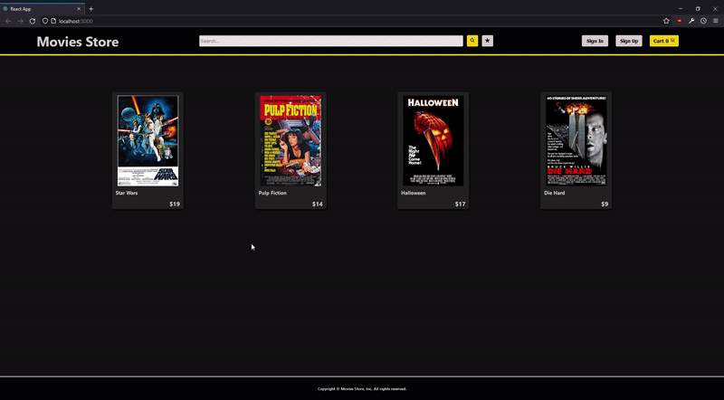

# Proyecto App Web con ReactJS

![alt text] (https://raw.githubusercontent.com/irf98/reactjs-project-ch/main/public/img/app-screenshot.PNG)

El siguiente proyecto sirve como ejemplo de desarrollo de una App web con ReactJS y utilizando Firebase como base de datos. Se construyó un e-commerce de películas que cuenta con las siguientes características:

* El manejo de productos dentro de la App permite las funciones de *agregar al carrito* y almacenar productos deseados en una *Wishlist*.
* Carrito interactivo: el usuario puede agregar varias unidades de un mismo producto al mismo tiempo y no perder la cuenta gracias a la incorporación de un contador en el *cart widget*. También se implementó el uso de *localStorage* para que el carrito sea persistente y no se pierdan los productos por algún refresh no deseado de la página.
* Los productos están presentes en el *Home* de la App o pueden filtrarse por categorías (géneros, en este caso) desde el *NavBar*.
* Para la navegación de las diferentes *views* de la App se utilizó *react-dom-router*.
* Como ya fue mencionado, se utilizó *Firebase* como base de datos para alojar los diferentes productos con su informació, ID y stock disponible. Tambien se utilizaron las funcionalidades de *Firebase Auth* para el manejo de usuarios dentro de la App, es posible:
    * Registrarse con email, iniciar sesión y cerrar sesión cuando el usuario lo desee.
    * En caso de no querer registrarse, se puede realizar una compra "anónima" completando los datos en un formulario al darle *"Buy now"* en la la ruta del carrito */cart*.
    * Es posible también recuperar la cuenta vía email, en la pantalla de *Sign in* aparece la opción de *Forgot password?* que al clickearla te ofrece poner tu dirección de email.
    * Los usuarios registrados tienen acceso a una *Wishlist* donde pueden guardar productos (en cantidad también) para comprar más tarde, estos pueden agregarse al carrito desde la propia wishlist.
* Diseño responsive para una correcta visualización en distintos dispositivos.

### Librerías extra

Se implementaron algunas herramientas extra al proyecto para solucionar, principalmente, temas de diseño y experiencia de usuario:

##### React Icons
Para el manejo de los iconos, React Icons recopila una gran variedad de iconos de diferentes librerías.
(https://react-icons.github.io/react-icons/)

##### React Spinners
Herramienta utilizada para implementar spinners de carga dentro de la App. Mejoran la experiencia de usuario al dar una señal de carga.
(https://github.com/davidhu2000/react-spinners)

##### App demo

